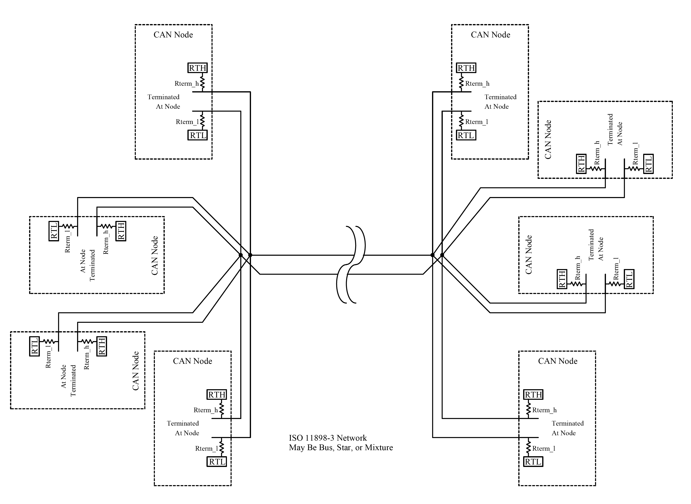
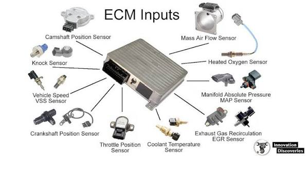
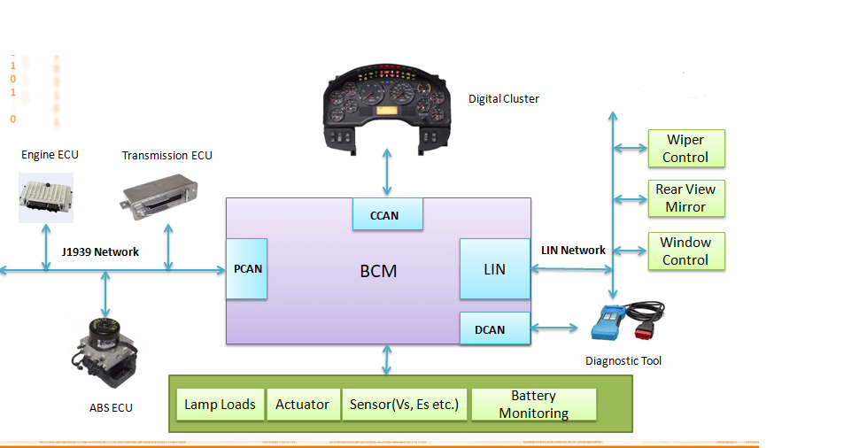

% CAN We or CAN't We
% Robert <robert@rtward.com> & Joe <kamikazejoe@gmail.com>
% Talk: [${TALK_URL}](${TALK_URL}) Repo: [${REPO_URL}](${REPO_URL})

# Rehash protocol info

 - Mostly used for cars
 - Similar to RS-422 / 485

## High-Speed Bus

::: notes

 - Each end has 120ohm resistor

:::

## Signaling

 - Signal 1 by driving high and low
 - Signal 0 by allowing them to equalize

## Low-Speed Bus

::: notes

 - Total resistence should be 100ohm
 - More fault tolerant

:::

## Signaling

 - Signal 1 by driving high and low
 - Signal 0 by inverting 1

## Protocol

 - Wait after message
 - Message start by driving high
 - Start with message ID

## Packet Format

## Priority

# What we tried to do
## Go to Junk Yard
## Grab a Steering Wheel and Instrument Cluster
## Wire everything up, sniff CAN
## Success!

# Where we went wrong
## Go back and get tools
## Return to Junk Yard
## Selected a random Chevy Riverside because it looked “newish”
## Attempt to remove steering wheel
## Watched Youtube video
## Removed Steering Wheel
## Oops… Too many wires.
## Confusion
## Attempting to find ECU
## Failure

# Things talking on the network

## ECU (Electronic Control Unit)

::: notes

The generic term for all the "computers" in the car.

The specific terms and what computers do is dependent on the manufacturer, but there's some generic ones.

:::

## ECM (Engine Control Module)

::: notes

The computer that controls the engine.

:::

## TCM (Transmission Control Unit)

::: notes

The computer that controls the transmission / shifting.

:::

## BCM (Body Control Module)

::: notes

The computer used to control locking, hvac, and other internal controls.

:::

## Radio / In Car Entertainment

::: notes

The computer used to control locking, hvac, and other internal controls.

:::

# LINBUS

Great, another thing.

::: notes

Usually used on a gateway to the CANBUS

:::

## How to actually play with it
## Tools
## MCP2515

# Inputs
## Steering Wheel Controls

# Outputs
## Instrument Cluster
## Simulator
## Live car connection

# Game Plan
## Go to Defcon and talk to the car hacking village
## Pick a car with a BCM
## Research how to take it apart
## Pull out the
## BCM
## Steering Wheel
## Instrument Cluster
## Wiring Harness
## Hook up to CAN port on BCM-ECU and power up
## Snoop on CANBUS
## Write to Displays

# Stretch Goals
## Game interface
## Remote testing

--- 

Robert <robert@rtward.com> & Joe <kamikazejoe@gmail.com>

Talk: [${TALK_URL}](${TALK_URL})

Repo: [${REPO_URL}](${REPO_URL})
