% CAN We or CAN't We
% Robert <robert@rtward.com> & Joe <kamikazejoe@gmail.com>
% Talk: [${TALK_URL}](${TALK_URL}) Repo: [${REPO_URL}](${REPO_URL})

# Rehash protocol info

 - Mostly used for cars
 - Similar to RS-422 / 485

## High-Speed Bus

::: notes

 - Each end has 120ohm resistor

:::

## Signaling

 - Signal 1 by driving high and low
 - Signal 0 by allowing them to equalize

## Low-Speed Bus

{width="55%"}

::: notes

 - Total resistence should be 100ohm
 - More fault tolerant

:::

## Signaling

 - Signal 1 by driving high and low
 - Signal 0 by inverting 1

## Protocol

 - Wait after message
 - Message start by driving high
 - Start with message ID

## Packet Format

## Priority

# The Plan!

::: notes

:::

## Step 1: Go to Junk Yard

::: notes

Step 1:
- We need car parts to car hack
- We aren't made of money, so new parts weren't an option
- To the Junk Yard!
- Figure it'll take about an hour, tops.

:::

## Step 2: Purchase Car Parts

- Steering Wheel with Buttons
- Instrument Panel

::: notes

- We weren't looking to do anything too elaborate
- Just want to see some data going across the CAN
- Prove we can read and write data
- Steering Wheel would give us some input to observe
- Instrument panel to write data out to

:::

## Step 3: Wire up, sniff CAN

::: notes

- We take everything home.
- Build a bench unit to test with
- Start sniffing CAN signals

:::

## Success!

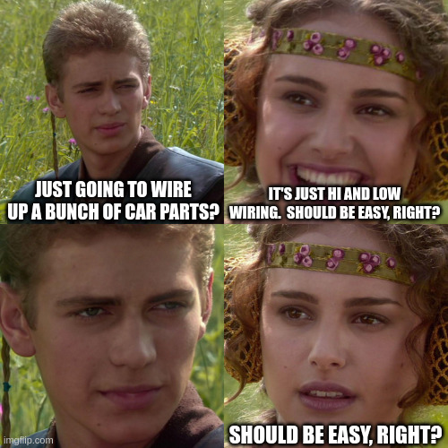

::: notes

:::

# Here's what actually happened...

::: notes

:::

## Step 1: Go to Junk Yard

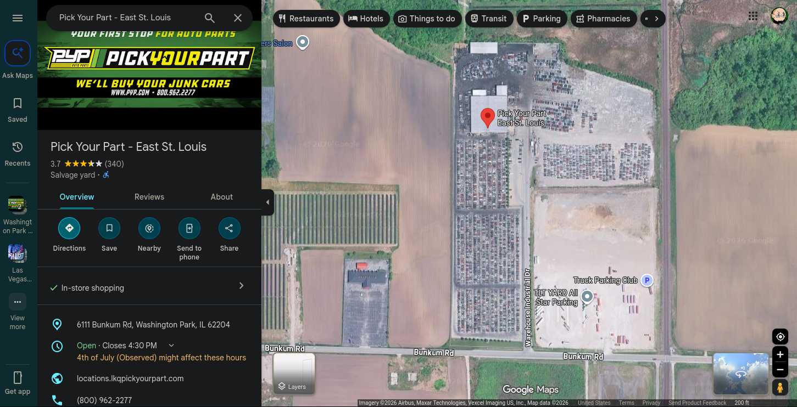{width="85%"}

::: notes

- Went as planned.
- Decided on PYP in Washington Park
- Bob and I got there nice an early on the weekend.

:::

## Step 2: No Kids Allowed

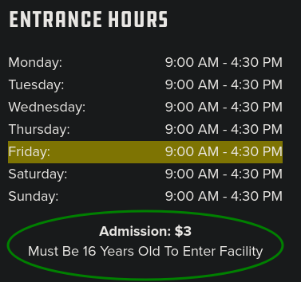

::: notes

- Bob brought his son with him.
- Turns out minors aren't allowed in the junk yard.
- Which we probably would've known if we had done the tiniest bit of research

:::

## Step 3: Come Back Another Day

::: notes

- So we came back another day.
- This time we left the children at home.

:::

## Step 4: Go back and get tools

::: notes

- Unfortunately we also left our tools at home.

:::

## Step 5: Return to Junk Yard

::: notes

- So, after driving home, grabbing tools, and driving back we are ready to start 
- after only losing an hour of the estimated hour job.

:::

## Step 6: Selected a random Chevy Riverside because it looked “newish”

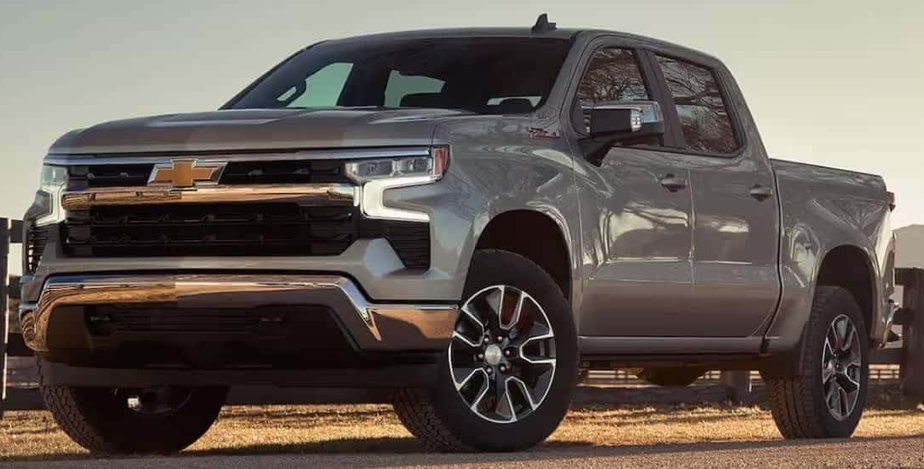{width="45%"}

::: notes

- So, after driving home, grabbing tools, and driving back we are ready to start 
- after only losing an hour of the estimated hour job.

:::

## Step 7: Attempt to remove steering wheel

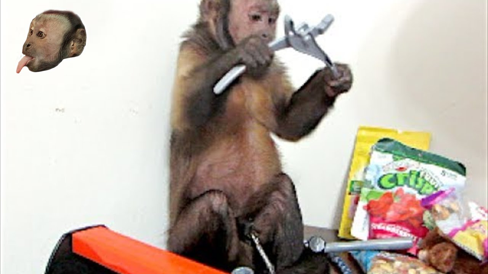

::: notes

- And thus began our shortlived career as mechanics.
- We were immediately stumped by the lack of screws or bolts

:::

## Step 8: Watched Youtube video

::: notes

- So, we turned to the internet
- Found a instructional video for removing this particular steering wheel

:::

## Step 9: Removed Steering Wheel

::: notes

- And it still took us way too long to remove it, but we did.
- In this case, there were little release buttons you had to push with a long screwdriver or allen wrench

:::

## Step 10: Oops… Too many wires.

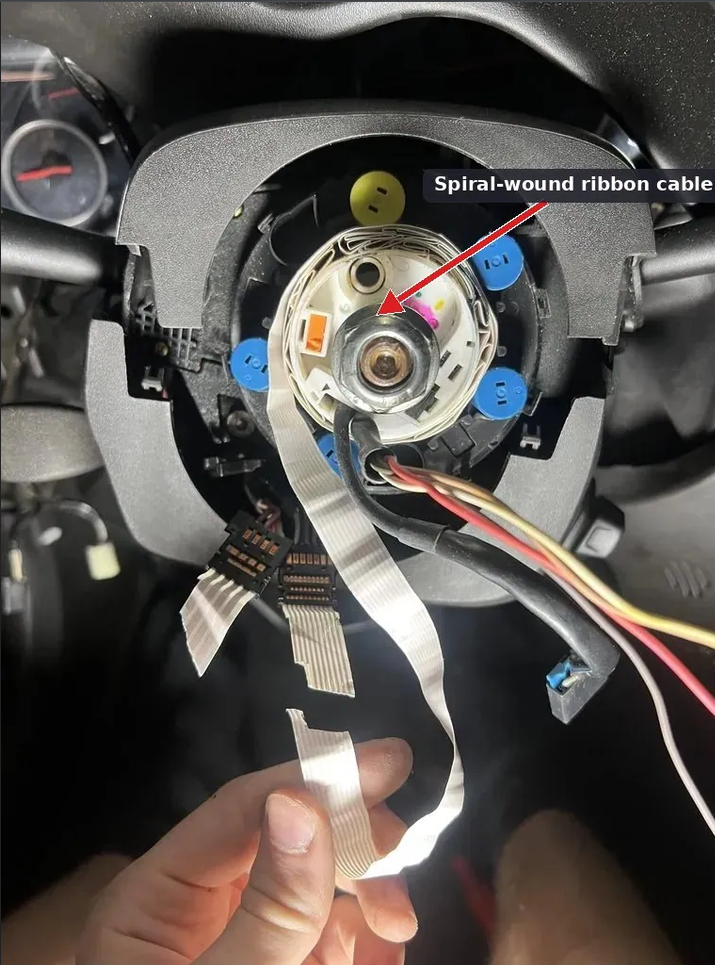{width="45%"}

::: notes

- So after we finally removed the steering with...
- We expected 2-4 wires.  Instead there was probabably closer to twenty.
- That's way too many wires for CAN bus.

:::

## Step K: Confusion

::: notes

- Okay. So what do these go to?
- Is there another controller that translates these into CAN?
- We assumed every thing just spoke to the Car's single computer over can.
- We are very confused at this point.  Again due to overconfidence and minimal research

:::

## Step L-12: More Googling

::: notes

- So more googling, and we start looking for other controllers and the ECU

:::

## Step Delta: Attempting to find ECU

::: notes

- We try to follow the various wireing harnesses around, but no luck
- The only think we found was a controller than handled the 4x4 system
- And being a junkyard, we couldn't even be sure it was there

:::

## Step "Fix TypeError: List Not Integer": Failure

::: notes

- So we accepted our ignorance and decided to head back and do more research and do more planning
- Next time we'll decide on a specific vehicle.
- Check the website and make sure they have it at the junkyard
- Learn how to remove the parts beforehand. 

:::

# Things talking on the network

## ECU (Electronic Control Unit)

::: notes

The generic term for all the "computers" in the car.

The specific terms and what computers do is dependent on the manufacturer, but there's some generic ones.

:::

## ECM (Engine Control Module)

::: notes

The computer that controls the engine.

:::

## TCM (Transmission Control Unit)

::: notes

The computer that controls the transmission / shifting.

:::

## BCM (Body Control Module)

::: notes

The computer used to control locking, hvac, and other internal controls.

:::

## Radio / In Car Entertainment

::: notes

The computer used to control locking, hvac, and other internal controls.

:::

# Local Interconnect Network (LIN)

Great, another thing.

## LIN

 - One wire serial format
 - Less reliable then CAN
 - But, cheaper
 - Max 16 nodes, one master with 15 slaves
 - Consistent latency

::: notes

Usually used on a gateway to the CANBUS

:::

## How to actually play with it

## Tools and Resources

- r/Carhacking
- The Car Hacker's Handbook
- MCP2515 Module
- SocketCAN
- ICSim

## r/Carhacking

- Like for everything, there's a subreddit
- Good Wiki to get you started
- People share DBC files, dumps, and write-ups of specific makes/models

::: notes

Where we ended up after the junkyard trip failed - realized we needed to do our homework first, and this is where a lot of that homework lives.

:::

## THE CAR HACKER'S HANDBOOK

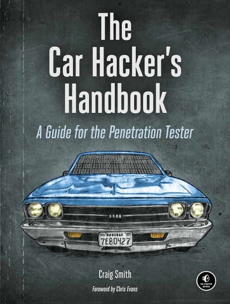{width="22%"}

- Written by Craig Smith
- Free online at opengarages.org
- Also available through No Starch Press

::: notes

- Excellent book online.
- Likely dated in some parts, but so is CAN
- Actually a pretty quick read for 300 pages
- Covers CAN basics, OBD-II/UDS diagnostics, ECU reversing, RF/key fobs
- The de facto starting reference for this whole space

:::

## MCP2515

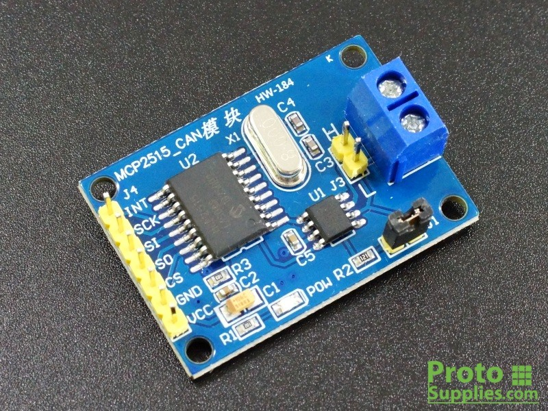{width="35%"}

- Cheap SPI CAN controller chip, a few dollars
- Paired with a transceiver chip (e.g. TJA1050) to actually drive the bus
- Common on Arduino "CAN bus shield" boards
- Lets a microcontroller speak CAN without needing a full Linux box

::: notes

- Simple SPI to CAN transciever
- These seemed very popular on r/Carhacking
- I bought 10 for $20 on eBay
- This is the easiest/cheapest way to get a device talking CAN if you don't want to go through a USB adapter and SocketCAN.

:::

## SocketCAN

- Linux kernel's native CAN networking stack
- Treats a CAN bus like a network interface, e.g. can0
- Standard userspace tools: candump, cansend, cangen, cansniffer
- Works with cheap USB-CAN adapters, including MCP2515-based ones

::: notes

- There is a CAN network module already in the Linux kernel
- Once you have a CAN interface setup, all your regular Linux networking tools will work.
- Like Wireshark

:::

## ICSim

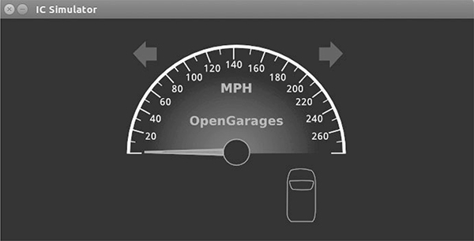{width="40%"}

- "Instrument Cluster Simulator"
- By the author of Car Hacker's Handbook
- Open Source

::: notes

- "Instrument Cluster Simulator", open source, also from Craig Smith
- Fake dashboard + a fake set of steering wheel controls, talking to each other over a virtual CAN bus
- No real car or hardware required to start practicing
- Includes a fuzzer for generating traffic, good for practicing sniffing/replay before touching real hardware

:::

## ICSim

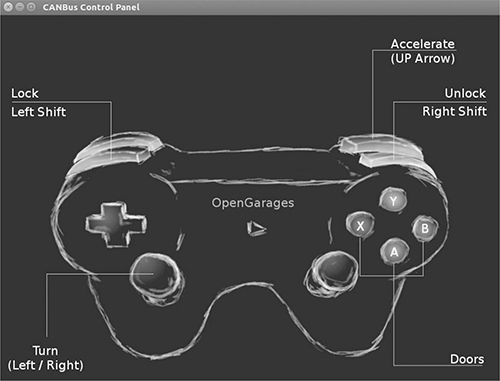

::: notes

It also supports gamepads, which gives us some bad ideas.

:::

# Inputs

## Steering Wheel Controls

- Buttons for volume, cruise control, phone, media
- Every button press becomes a CAN (or LIN) frame
- By "input", we just means "writes to the bus"
- Sometimes directly connected to the BCM
- Sometimes connected to a LIN bus

::: notes

- Obviously modern steering wheels have lots of buttons
- Gives us a lot of signals to capture
- Should be simple enough to probe
- Just a matter of capturing the packets going across the CAN
- Everything get's sent to the BCM, 
- or the LIN buss which then bridges onto the CAN bus

:::

# Outputs

## Instrument Cluster

- Speedometer, warning lights, odometer
- Doesn't originate data, just displays data from the bus
- Trusts the bus completely - no sanity checking on received values

::: notes

- Just outputs data it picks up from the bus.
- Almost like a dumb terminal in that way.
- Because it just displays whatever it's told, this would make it a target for any kind of attack
- A fancy digital dashboard on a new car today might not be as easy to interface though

:::

## Simulator

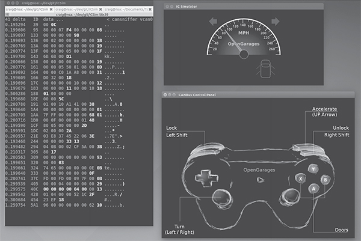

::: notes

- This is where ICSim comes in.
- Gives you a dashboard to accept CAN input
- At the same time, you can monitor the traffic
- Can also reply captured traffic to help validate your findings
- It also allows for adjustable levels of simulated background noise to mimic real-world

:::

# Live car connection

::: notes

:::

# Game Plan

## Go to Defcon and talk to the car hacking village

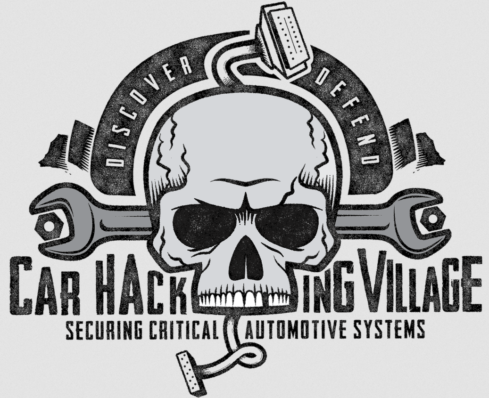{width="40%"}

::: notes

- Going to get some more hands on research.
- The Car Hacking Village is a Defcon staple
- At minimum, get a clue on how to setup a proper test rig
- And hopefully get some experience talking to CAN

:::

## Pick a car with a BCM
## Research how to take it apart

## Junkyard Shopping List

- BCM
- Steering Wheel
- Instrument Cluster
- Wiring Harness

::: notes

- At this point we figure we need at least these parts
- As we continue to research, this list could expand

:::

## Hook up to CAN port on BCM-ECU and power up

## Snoop on CANBUS

::: notes

- With more knowledge
- And knowing where to find help
- And presumably a working test rig
- We can get back to our original goals
- And start capturing CANBUS traffic
- Capturing signals is something we are bit more comfortable with at this point
- Don't anticipate any problems.
- Famouse last words.

:::

## Write to Displays

# Stretch Goals
## Game interface

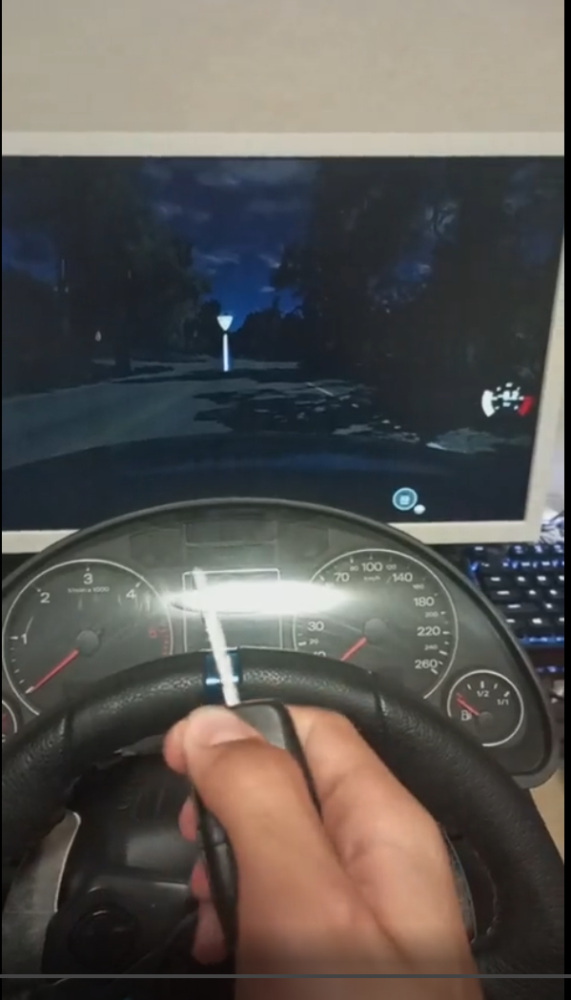{width="30%"}

::: notes

- Saw a redditor wire up an Audi control panel, including the key, to a driving sim.
- Thought it would be fun to do something similar, time permitting

:::

## Remote testing

::: notes

- CANiBUS

:::

--- 

Robert <robert@rtward.com> & Joe <kamikazejoe@gmail.com>

Talk: [${TALK_URL}](${TALK_URL})

Repo: [${REPO_URL}](${REPO_URL})
